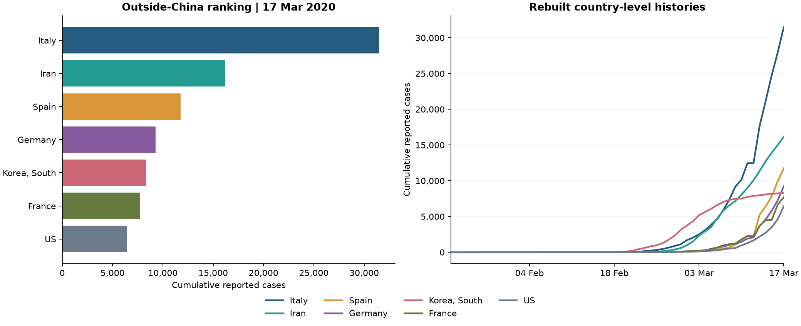

# COVID-19 Early Outbreak Analysis

[](https://github.com/1hugemtf/covid-early-outbreak-analysis/actions/workflows/validate.yml)

**A checked, reproducible view of reported confirmed cases from 22 January to 17 March 2020.**

[Read the notebook](notebook.ipynb) · [Open in Colab](https://colab.research.google.com/github/1hugemtf/covid-early-outbreak-analysis/blob/main/notebook.ipynb)


## The question

How did reported confirmed cases change during this early historical window, and can the supplied country, regional and worldwide files be reconciled?

This Python adaptation of a DataCamp R exercise focuses on trustworthy aggregation and clear time-series visualization. It is a historical portfolio project, not a current health dashboard or forecasting model.

## Findings from this snapshot

| Measure | Result |
|---|---:|
| Dates covered | 56 |
| Worldwide reported total on 17 March 2020 | 197,146 |
| China / outside China on the final date | 81,058 / 116,088 |
| First outside-China total exceeding China | 15 March 2020 |
| Largest outside-China total on the final date | Italy: 31,506 |
| Daily reconciliation mismatches | 0 |

These figures describe the supplied archive, not revised present-day historical estimates.



## Data issues found and resolved

**Province rows were not country totals.** The country file contains intermediate cumulative totals within a date. Summing those values would overcount. The analysis sums daily `cases` by country and date first, then accumulates in chronological order. A test fixture verifies that province aggregation preserves negative corrections and ignores the misleading cumulative input field.

**The top-seven file repeats country-date records.** It is retained for provenance but not used to plot country histories. Rankings are reconstructed at the final date rather than taking a maximum over all dates.

**The archive includes different snapshots.** The broader raw file ends on 16 March; the analysis files extend to 17 March. On 16 March, the raw file's reconstructed worldwide total is 15 cases higher than the worldwide analysis file. The notebook reports this difference instead of merging incompatible snapshots.

**The original crossover claim was off by one day.** The notebook calculates 15 March directly from the supplied regional series.

## Analysis and charts

- Worldwide cumulative totals and China versus outside China.
- Daily reported changes with seven-day trailing averages and archived event labels.
- Final-date outside-China ranking and rebuilt country histories.
- The same outside-China series on linear and logarithmic axes.

All four charts are embedded in the executed notebook and exported as PNGs. No JavaScript chart renderer, remote images or live data downloads are needed.

## Interpretation

Reported confirmed cases are not all infections. Testing, definitions, reporting delays, corrections and geographic conventions affect the observed curves. The first observation is an opening balance, so it is excluded from the daily-change plot. Negative corrections are retained.

Event labels come from the supplied exercise file and provide context, not causal evidence. Absolute country counts are not population-adjusted. No claims about lockdown effectiveness, individual risk, transmission rates or future growth are made. A straight-looking segment on a log plot is not a validated forecast.

## Run locally

Use Python 3.12. Download the repository ZIP and extract it, or clone it:

```bash
git clone https://github.com/1hugemtf/covid-early-outbreak-analysis.git
cd covid-early-outbreak-analysis
python -m venv .venv
```

Activate on Windows PowerShell:

```powershell
.venv\Scripts\Activate.ps1
```

Or on macOS/Linux:

```bash
source .venv/bin/activate
```

Then install and open:

```bash
python -m pip install -r requirements.txt
python -m jupyterlab notebook.ipynb
```

Use **Restart Kernel and Run All Cells**. The notebook reads the six CSVs in `datasets/` and writes four charts at the repository root.

For Colab, upload all six source CSVs into a `datasets` folder before running. Colab is an optional convenience; the pinned Python 3.12 environment is the automated validation target.

## Automated verification

```bash
python -m pip check
python validate_notebook.py
```

The validator clears all outputs, runs every notebook cell in a fresh kernel, and checks date coverage, unique country-date records, province aggregation, negative corrections, all-date reconciliation, known snapshot totals, final-date rankings, the crossover date, rolling means, the raw-snapshot discrepancy and chart exports. It saves the executed notebook. GitHub Actions runs these checks for pushes and pull requests, then stores the executed notebook and charts as an artifact.

## Files

- `notebook.ipynb`: executed Python analysis and interpretation.
- `datasets/`: six original CSV files, unchanged; see its README for their roles.
- `outbreak_overview.png`, `daily_reported_changes.png`, `country_comparison.png`, `linear_and_log_scales.png`: exported figures.
- `validate_notebook.py`, `requirements.txt`, `.github/workflows/validate.yml`: reproducibility and automated checks.

## Provenance

Adapted from `workspaceCOVID.zip`, a supplied DataCamp R learning project. Its original narrative attributes the underlying data to the Rami Krispin `coronavirus` repository and Johns Hopkins CSSE sources. This edition ports the analysis to Python and revises aggregation, interpretation, charts and validation. The original CSV bytes are preserved; differing source snapshots are explicitly documented. Source-data rights remain with their respective owners; no blanket license is asserted over third-party data.

**Hamed Dhiaa** · [Portfolio](https://1huge-dhiaa.carrd.co) · [LinkedIn](https://www.linkedin.com/in/dhiaa-hamed/)
