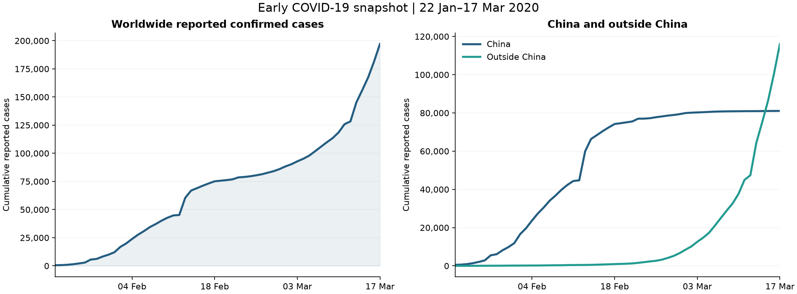

# COVID-19 Early Outbreak Analysis

**A checked, reproducible view of reported confirmed cases from 22 January to 17 March 2020.**

[Read the notebook](notebook.ipynb) · [Open in Colab](https://colab.research.google.com/github/DhiaaHamed/covid-early-outbreak-analysis/blob/main/notebook.ipynb)

## The question

How did reported confirmed cases change during this early historical window, and can the supplied country, regional and worldwide files be reconciled?

This Python adaptation of a DataCamp R exercise focuses on trustworthy aggregation and clear time-series visualization. It is a historical portfolio project, not a current health dashboard or forecasting model.
